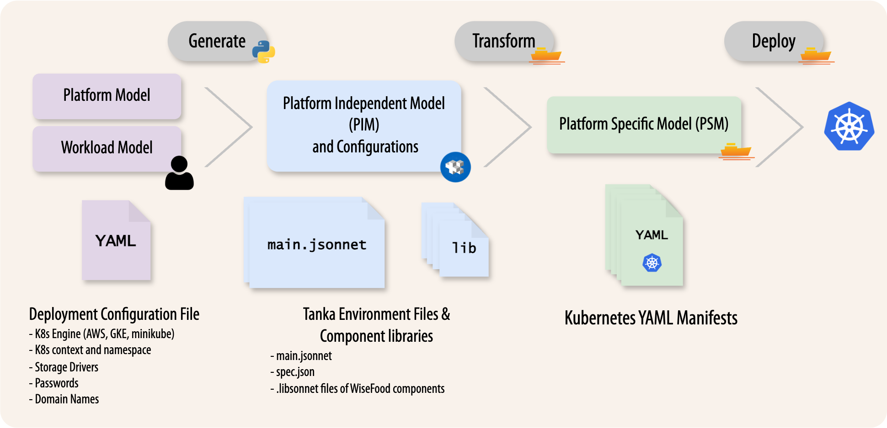

# WiseFood Platform Deployment 
This repository contains scripts &amp; configurations for deploying the WiseFood Platform on a Kubernetes Cluster of any size.


The Wisefood platform brings along a set of open-source tools and microservices to implement a complete food recommendation suite of LLM-powered applications (_FoodScholar_, _RecipeWrangler_, _FoodChat_). 


## Core Components (tentative - constantly updated)
- **PostgreSQL**: The relational database of the system, used to store user data and other forms of structured data.
- **Redis**: An in-memory data structure store, used as a caching layer to improve performance.
- **MinIO**: An object storage service, used to store artifacts of the data catalog as well as user-uploaded content.
- **ElasticSearch**: A search engine and database, serving as the backbone of the data catalog, facilitating efficient search and retrieval of food-related scientific knowledge.
- **Neo4j**: A graph database, used to store and manage complex relationships between food entities, ingredients, recipes, and user preferences.
- **Keycloak**: An open-source identity and access management solution, used to handle user authentication and authorization across the platform services.
- **Data Catalog**: A structured repository that organizes and manages food-related scientific knowledge, recipes, national dietary guides, food composition tables and user data.

## Deployment Orchestration
The WiseFood platform is deployed on Kubernetes, and as such, it requires a flexible deployment logic to accomodate different cluster sizes and configurations (e.g., on-premise vs cloud, single-node vs multi-node, etc.). To this end, we employ a **configuration-as-code** approach, by using [Grafana Tanka](https://tanka.dev/) and the [Jsonnet](https://jsonnet.org/) programming language to define the deployment logic and configurations.

Jsonnet is a versatile extension of JSON that allows for more complex configurations of JSON objects to be composed in a principled manner. Tanka is a tool that leverages Jsonnet to manage Kubernetes resources, allowing for the definition of complex deployment scenarios in a more manageable way through the generation of Kubernetes YAML manifests from Jsonnet code.

In principle, we follow a **model-driven** approach, where the user defines a set of configuration parameters in a YAML files, upon which a specific Tanka environment is generated via a custom python utility (_wisefoodctl.py_). The environment is composed by both the configurations provided by the user, as well as the invariant microservice Jsonnet libraries, which in turn constitute the Platform Independent Model (PIM). Together, these elements are compiled via Tanka to the final Kubernetes YAML manifests which represent the Platform Specific Model (PSM), ready to be deployed on the target Kubernetes cluster.



## wisefoodctl.py - Preliminaries
The `wisefoodctl.py` script is a command-line utility that facilitates the full lifecycle management of tools and environments required to deploy the WiseFood platform on a Kubernetes cluster. It significantly simplifies the deployment process for users with no prior experience with Tanka or Jsonnet, by automating the generation of Tanka environments and initial configuration of secrets and passwords over the selected Kubernetes cluster.

To run the script ensure you have Python 3.9+ installed, then install the required dependencies using pip:
```bash
pip install -r requirements.txt
```

By running `python wisefoodctl.py --help`, the user is presented with the following options:

```bash
usage: wisefoodctl.py [-h] {sample,init,validate,list,env,deps,install} ...

Wisefood Deployment Control Tool

positional arguments:
    sample              Generate a sample YAML configuration file
    init                Initialize directory structure and install dependencies
    validate            Validate tools and repo structure
    list                List available Tanka environments
    env                 Build an environment based on an input YAML file
    deps                Manage Jsonnet/Helm chart dependencies
    install             Install tooling (requires sudo)

options:
  -h, --help            show this help message and exit

```

## Prerequisites
Before proceeding with the deployment, ensure you have the following prerequisites in place:
- A running Kubernetes cluster (version 1.21 or higher) with `kubectl` configured to interact with it. For local testing, you can use [**Minikube**](https://minikube.sigs.k8s.io/docs/start/?arch=%2Fmacos%2Farm64%2Fstable%2Fbinary+download)
- Python 3.9 or higher installed on your local machine.
- `kubectl` command-line tool installed and configured to access your Kubernetes cluster.
- A separate namespace in your Kubernetes cluster where the WiseFood platform will be deployed. (e.g., `wisefood-dev`).
- A domain name pointing to your Kubernetes cluster's ingress controller (for production deployments) plus 2 subdomain for auth and S3 services (e.g. `auth.yourdomain.com` and `s3.yourdomain.com`). 

    *If you are running on a local cluster like Minikube you can use `s3.minikube` and `auth.minikube` as subdomains*.

## Deployment Steps
1. **Clone this Repository** to your local machine:
    ```bash
    git clone https://github.com/wisefood/platform-deployment.git
    ```

2. **Install Python Requirements**:
    ```bash
    pip install -r requirements.txt
    ```

3. **Install Required Tools & Build Directory Structure**: This step is fully automated by the `wisefoodctl.py` script. It will create the necessary directory structure and install required tools such as Tanka and Jsonnet libraries. 

    **In principle, this step is required only once**.
    ```bash
    python wisefoodctl.py init
    ```
    (Note: This step may require `sudo` privileges to install system-wide tools. If you encounter permission issues, consider running the command with `sudo`.)

4. **Generate a Sample Configuration File**: This file will serve as a template for your declaring your deployment settings.
    ```bash
    python wisefoodctl.py sample
    ```
    This will create a file named `example_config.yaml` in the current directory.
    The generated file has the following structure:
    ```yaml
    # This is a sample configuration file for the WiseFood platform deployment. 
    # It is provided as input to the bootstrap script for generating Kubernetes secrets and
    # configuring the Tanka environment.

    # Tanka Environment name (e.g., "staging", "production", "minikube.dev")
    env: "wisefood.dev"

    # Define either "amazon" for AWS or "minikube" for local Kubernetes
    platform: "minikube"

    # The Kubernetes context to use (i.e. the cluster to deploy to)
    k8s_context: "minikube"

    # The Kubernetes namespace for deployment
    namespace: "wisefood-dev"

    # The contact person for this configuration
    author: "user@example.com"

    dns:
    - domain: "minikube"  # DNS configuration name, could be "wisefood.gr" or "wisefood-project.eu" for public configs
    - scheme: "http"  # Scheme to use (e.g., "http" or "https")
    - subdomains:
        -  keycloak: "auth"  # Keycloak subdomain
        -  minio: "s3"  # MinIO subdomain

    config:
    - smtp: 
        [....]  # SMTP configuration for email services. Not required for local deployments

    secrets:
        [....]  # Secrets for databases, services, and admin users
    ```
    **Fill in the configuration file with your specific settings, including secrets and service configurations. Make sure to replace placeholder values with secure and appropriate values for your deployment.**

5. **Build the Tanka Environment**: Use the filled configuration file to generate the Tanka environment.
    ```bash
    python wisefoodctl.py env example_config.yaml
    ```
    This command will create a new Tanka environment in the `environments/wisefood.dev` directory (or whatever name you specified in the config file). The directory will contain two files:
    - `main.jsonnet`: The main Jsonnet file that includes the WiseFood platform configurations.
    - `spec.json`: The generated Kubernetes manifests ready for deployment.

6. **Deploy the WiseFood Platform**: Navigate to the newly created environment directory and apply the configuration to your Kubernetes cluster using Tanka.
    ```bash
    tk apply environments/wisefood.dev
    ```
    This command will deploy all the WiseFood platform components to your specified Kubernetes namespace.

Congratulations! You have successfully deployed the WiseFood platform on your Kubernetes cluster.